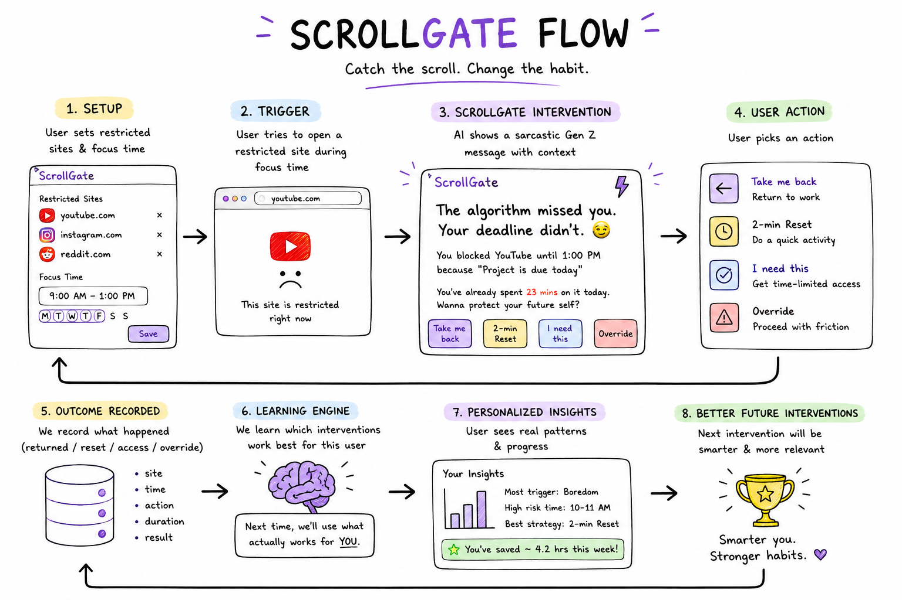
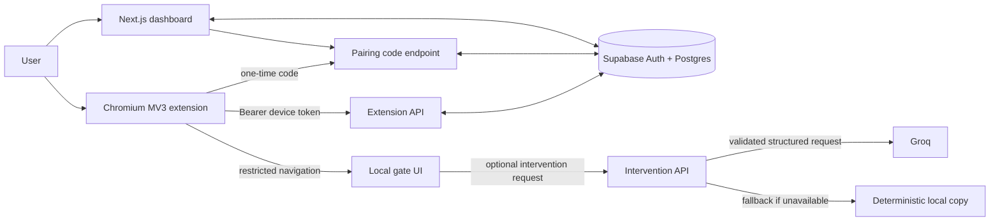

# ScrollGate

> **Catch the scroll. Change the habit.**

ScrollGate is a browser-focus prototype that intercepts a user before they open a distracting website during a scheduled focus period. Instead of silently blocking the page, it gives the user a small, intentional choice: return to work, take a short reset, request time-limited access, or override with visible friction.

The product consists of a **Next.js dashboard**, a **Chromium Manifest V3 extension**, a **Supabase-backed API and data model**, and optional **Groq-generated intervention copy**. Enforcement remains local to the extension, so a temporary API or AI failure does not make restricted websites accessible.

**Prototype status:** the end-to-end rule, pairing, enforcement, event-recording, intervention, and adaptive strategy loop are implemented. Strategy scores are updated from terminal outcomes after the adaptive scoring migration is applied; deployment-only acceptance checks remain account-specific.

## Product flow



The diagram describes the intended product loop. The mapping below makes clear which parts are implemented in this prototype.

| Flow stage | Prototype behavior | Status |
| --- | --- | --- |
| 1. Setup | A signed-in user creates restricted domains, schedules, a reason, and an intervention tone in the Next.js dashboard. | Implemented |
| 2. Trigger | The Chrome extension compiles active rules into dynamic network rules and intercepts restricted navigation before page content loads. | Implemented |
| 3. Intervention | The extension presents a gate. The server can request concise, validated intervention copy from Groq, with a safe deterministic local fallback. | Implemented |
| 4. User action | The gate supports return-to-work, a two-minute reset, time-limited intentional access, and an override path. | Implemented |
| 5. Outcome recorded | Attempts, decisions, and follow-up events are queued locally and sent to the authenticated server with idempotency protection. | Implemented |
| 6. Learning engine | Terminal outcomes update per-domain, time-bucketed strategy scores through a server-side database function. | Implemented |
| 7. Personalized insights | Insights show the strongest strategy only after each candidate has enough resolved evidence. | Implemented |
| 8. Better future interventions | New gates explore under-sampled strategies, then select the strongest evidence-backed strategy for that domain and time bucket. | Implemented |

## The problem it addresses

Conventional site blockers often fail at the moment of temptation: they are either too easy to dismiss or too rigid to support legitimate work. ScrollGate treats a blocked visit as a brief decision point. It preserves the user's agency while recording the choice and making impulsive overrides more intentional.

The primary prototype use case is a user who wants to protect a scheduled focus window from domains such as YouTube, Instagram, Reddit, or other self-selected sites.

## Architecture



### Core design decisions

- **Local-first enforcement:** the extension stores synced rules, schedules, temporary grants, and unsent events locally. It can keep enforcing known rules even if the network is unavailable.
- **Pre-load blocking:** dynamic network rules are used instead of waiting for page JavaScript to load, reducing the chance that distracting content appears first.
- **Server-only secrets:** Supabase service credentials, Groq credentials, and the token pepper are never exposed to the browser extension or client bundle.
- **Optional AI, never a dependency for blocking:** Groq produces short, structured copy only. A fallback message is used if the API key is absent, the model fails, times out, or returns invalid content.
- **Event integrity:** browser-to-server requests use a device token; event UUIDs and database constraints prevent accidental replay or duplicate ingestion.

## Implemented capabilities

### Web dashboard

- Email/password authentication with Supabase.
- A restriction workspace for domains, focus schedules, personal reason, and message tone.
- A browser pairing screen that generates a one-time six-digit code.
- Dashboard, settings, and insight-oriented views for the product workflow.
- A setup-required state when Supabase configuration is missing, rather than pretending the app is connected.

### Browser extension

- Chromium-compatible Manifest V3 extension.
- Scheduled, domain-based restriction matching.
- Dynamic-rule enforcement before the target page is displayed.
- A gate surface with four intent-aware actions:
  - **Take me back** — leave the distracting site.
  - **2-minute reset** — record a small reset action.
  - **I need this** — grant limited intentional access.
  - **Override** — continue through a higher-friction path.
- Local persistence for configuration, temporary access sessions, and queued events.
- Pairing with the web app via a one-time code; the extension receives the raw device token only once.

### Server, database, and AI boundary

- Next.js API routes for pairing, configuration sync, event ingestion, and interventions.
- A Supabase migration defining the application data model and row-level security policies.
- Rule-version based configuration sync so an extension can detect updated rules.
- Validated Groq structured output, prompt-injection boundaries, a request timeout, and an honest local fallback.

## API contract

The extension does not use the user's Supabase session directly. After pairing, it authenticates its server calls with its own device token in the `Authorization: Bearer ...` header.

| Endpoint | Purpose | Caller |
| --- | --- | --- |
| `POST /api/extension/pair-code` | Create a short-lived, one-time pairing code for the signed-in dashboard user. | Web dashboard |
| `POST /api/extension/pair` | Exchange the pairing code for the browser's device token and initial configuration. | Extension |
| `GET /api/extension/config` | Fetch the latest rules and configuration for a paired browser. | Extension |
| `POST /api/extension/events` | Ingest queued attempt and outcome events idempotently. | Extension |
| `POST /api/interventions` | Return validated Groq copy or deterministic fallback copy for a gate. | Extension |

## Data model

The migration at [`supabase/migrations/20260718065617_scrollgate_mvp_schema.sql`](supabase/migrations/20260718065617_scrollgate_mvp_schema.sql) defines ten focused tables:

| Table | Responsibility |
| --- | --- |
| `profiles` | User-level preferences and account metadata. |
| `restrictions` | Domains, schedules, reasons, tones, and rule versions. |
| `browser_connections` | Paired browser identity and hashed device-token data. |
| `browser_pairing_codes` | One-time, expiring pairing-code digests. |
| `restriction_attempts` | A restricted visit and its selected outcome. |
| `attempt_events` | Ordered, idempotent client-side activity events. |
| `interventions` | Intervention content, source, and delivery metadata. |
| `access_sessions` | Time-limited intentional access grants. |
| `strategy_scores` | Per-domain, time-bucketed strategy effectiveness scores updated from resolved outcomes. |
| `ai_request_logs` | Minimal operational metadata for AI requests and fallbacks. |

All ten tables have row-level security. Direct client access is limited to the user's permitted profile and rule data; pairing-token handling, event ingestion, intervention logging, and privileged mutations stay on the server.

## Privacy and security posture

- The extension is designed to sync configured-domain and decision metadata, not full browsing history, page contents, or complete URL paths.
- Pairing codes and browser device tokens are stored as HMAC digests using `SCROLLGATE_TOKEN_PEPPER`; raw values are not stored in the database.
- Pairing codes are single-use and expire.
- The extension's token is scoped to the paired browser connection, separate from the user's web-session token.
- CORS is constrained to Chrome-extension origins for extension API traffic.
- AI copy is safety-checked and constrained to a small structured response; it cannot decide whether a restriction is enforced.

This is a prototype, not a completed privacy or security audit. Production work should include threat modeling, abuse testing, retention/deletion policy, monitoring, and external security review.

## Technology

| Area | Choice |
| --- | --- |
| Web application and API | Next.js App Router, TypeScript, Tailwind CSS |
| Authentication and database | Supabase Auth and Postgres with RLS |
| Browser enforcement | Chromium Manifest V3 extension, dynamic network rules |
| AI copy generation | Groq SDK with a configurable model |
| Validation | Zod |
| Hosting | Vercel |

## Repository layout

```text
src/
  app/                 Next.js pages and API routes
  components/          Dashboard, pairing, restriction, and settings UI
  lib/                 Auth, schedules, schemas, AI boundary, Supabase clients
  proxy.ts             Extension-origin CORS handling
extension/             Chromium Manifest V3 extension source
supabase/migrations/   Database schema, functions, policies, and constraints
public/                Static assets, including the ScrollGate flow diagram
```

## Run locally

### Prerequisites

- Node.js 20 or later.
- A Supabase project with Email/Password authentication enabled.
- A Groq API key if AI-generated copy is desired. The prototype works with fallback copy without one.
- Chromium/Chrome for loading the extension.

### 1. Configure environment variables

Copy [`.env.example`](.env.example) to `.env.local` and fill in your own values. Never commit `.env.local`.

```text
NEXT_PUBLIC_SUPABASE_URL=
NEXT_PUBLIC_SUPABASE_PUBLISHABLE_KEY=
SUPABASE_SERVICE_ROLE_KEY=
SCROLLGATE_TOKEN_PEPPER=
GROQ_API_KEY=
GROQ_MODEL=openai/gpt-oss-20b
```

Generate `SCROLLGATE_TOKEN_PEPPER` as a long random secret. Keep the service-role key, Groq key, and pepper server-side only.

### 2. Provision Supabase

Apply [`supabase/migrations/20260718065617_scrollgate_mvp_schema.sql`](supabase/migrations/20260718065617_scrollgate_mvp_schema.sql) to a fresh prototype database. Then configure Supabase Auth with these redirect URLs:

```text
http://localhost:3000/auth/callback
https://YOUR-VERCEL-DOMAIN/auth/callback
```

Set the site URL to the environment you are using, for example `http://localhost:3000` locally.

### 3. Run the dashboard

```bash
npm install
npm run dev
```

Open `http://localhost:3000`, sign up or sign in, then create a restriction and a browser pairing code.

### 4. Build and load the extension

```bash
cd extension
npm install
npm run build
```

In Chromium, open `chrome://extensions`, enable **Developer mode**, choose **Load unpacked**, and select `extension/.output/chrome-mv3`. Open the extension popup, provide the deployed or local app URL and the pairing code, then pair the browser.

## Deployment

The web app is configured for Vercel as a Next.js application. A live prototype deployment is available at [promptwars-flame.vercel.app](https://promptwars-flame.vercel.app).

For the complete production procedure—including Vercel environment variables, Supabase Auth configuration, Chrome Web Store packaging, browser pairing, troubleshooting, and the acceptance checklist—follow the [production deployment runbook](DEPLOYMENT.md).

For a new Vercel environment:

1. Import this repository and use the **Next.js** framework preset.
2. Keep the project root at this repository's `scrollgate` directory if importing from its parent workspace.
3. Add every variable from `.env.example` in Vercel's environment settings; use production Supabase credentials and a fresh token pepper.
4. Add the final Vercel domain to Supabase Auth redirect URLs and Site URL.
5. Redeploy after changing environment variables.

The extension must be paired with the public application URL that the user will actually use.

## Verification performed

The project has been checked with the following commands:

```bash
npx eslint src --max-warnings 0
npx tsc --noEmit
npm run build
cd extension && npm run typecheck && npm run build
```

For evaluator or manual acceptance testing, verify the following sequence:

1. Create an account and a scheduled restriction in the dashboard.
2. Generate a pairing code and pair a freshly loaded extension.
3. Visit a restricted domain while the schedule is active and confirm the gate appears before content loads.
4. Test each gate choice and confirm temporary access expires as expected.
5. Disconnect the network after a configuration sync and confirm known restrictions still apply.
6. Restore the network and confirm queued events are delivered once, without duplicates.
7. Test an intervention with and without a valid Groq key to confirm both validated AI copy and deterministic fallback behavior.

## Prototype boundaries and next milestones

The current repository intentionally does **not** claim the following as completed:

- Native mobile extensions or support beyond Chromium-class browsers.
- Production-scale analytics, abuse prevention, retention controls, or a formal security review.
- A guarantee that every remote Supabase/Vercel environment has been provisioned; deployment configuration remains account-specific.

The next milestones are bounded offline queues, abuse controls, retention/deletion controls, automated tests, and production acceptance testing.
